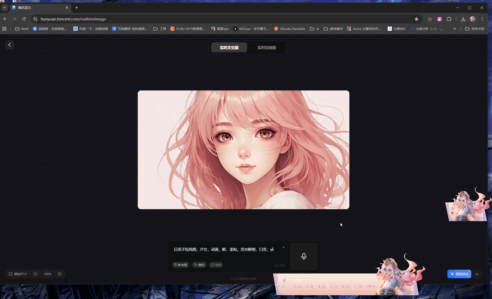
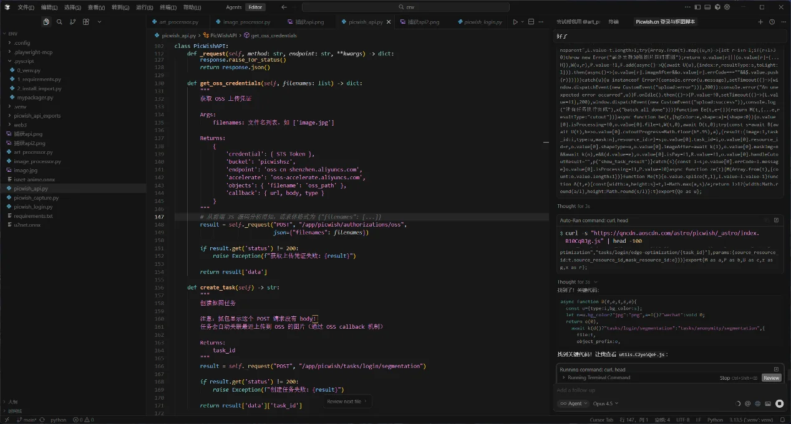
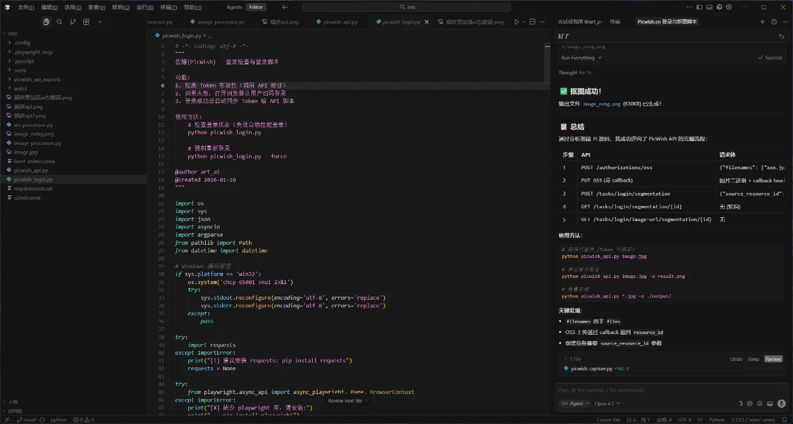
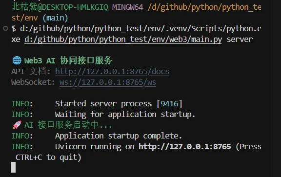

它是我写出来其他ai工具能产出的非常重要的基础

简单来说，是ai主力调用浏览器mcp，脚本辅助记录post等请求数据，人类辅助人机验证的立体作战

来实现通用的给任何网站实现自动化抓取api、爬虫下载内容

为什么需要抓

   
比如下面这是好用的工具混元ai，他可以立刻出图，延迟近乎只取决于网络下载

    但是如果让人类手动一次一次调提示词，那根本就没有效率

    我们需要大量icon图标拿去验证游戏

   
所以使用脚本，哪怕为了防止大量请求只去1秒请求一次，我们挂个5分钟都能产出300份素材

让ai自己生成美术提示词，自己调用这些美术ai工具脚本进行生成和后处理，然后再ai自己拿回来拼，实现美术全自动的第一步

优势在哪

   
成功率更高，门槛更低（完全不需要写代码，只要有基本的网络理解），抓一个简单网站更是1小时左右能完成

   

传统方式慢在哪

程序员用脚本记录下手动时所有操作，慢慢从里面筛出post和get请求，所有抓取请求的文件是超级大

像需要图片上传的之类的，图片上传本身不与网站相关而是传到其他地方（比如阿里
OSS、微博知乎搜狗图床），本身网站就与其他网站有交互，理解成本直线飙升

   
代码混淆，人类难以阅读：javascript进行混淆之后，所有的变量都是abcd等无规则命名变量，对于程序员难以读懂，或者需要大量工具辅助

   

但是，对于ai来说，高效检索，理解混淆代码并不是很难，而且大量需要复现尝试时，ai能帮手快速验证流程

   
当然，这个思路也容易能拿去做不合法的事情，所以网上近乎是没有资料的。这个是我和ai一起搓出来的工具

{width="5.763888888888889in"
height="3.0902777777777777in"}

简述设计思路

首先人工+脚本的捕获要过关

独立缓存目录，不要用自己安装自己用的浏览器缓存目录，能防止各种问题

追加参数，禁止首次运行、禁止默认浏览器运行、指定端口启动来保证捕获

然后就可以让ai配合了，拉起服务，借助脚本记录捕获信息，ai用浏览器mcp去访问网址，全自动操作来协同作战

中间过程交给ai就行了，如果有ai不能复现的步骤，或者需要登录的就人类手动帮一下，复现全流程，需要可以打点记录，中途有什么现象记得跟ai交代

{width="5.683825459317585in"
height="0.7250623359580053in"}

然后实现脚本的时候就可以直接用稳定api，根据情况有需要也可以用浏览器模拟，通过mcp配置无头模式headless就可以实现无界面的自动化操作了
