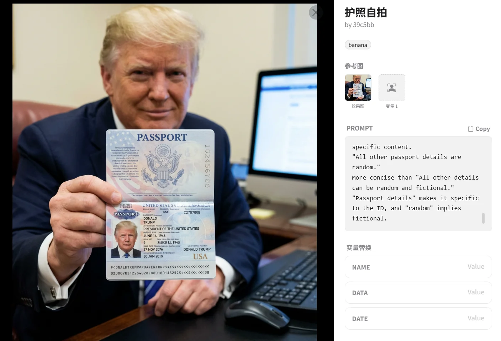
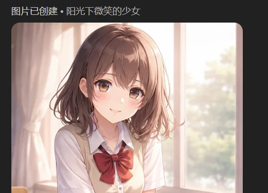

腾讯混元文生图2d

https://hunyuan.tencent.com/realtimeImage

特点是生成速度极快，他的产图速度能比网络传输还快，可以产生非常好的画风效果（能有更柔和的光影，神态细节也能很丰富），但提示词不一定全都生效，难以准确控制（尤其是提示词一长），有严苛的提示词限制，指定人物名字基本不会生效。

Nano banana

带水印，但是效果不错

画风复刻的效果相当不错，非常适合拿来通过模版批量复刻，不同角色的表情包

https://www.bilibili.com/video/BV16zSEBGEwM

这个网站有各种模版，换个变量就可以用了

<https://prompt.vioaki.xyz/>

Sd webui

我认为目前开源免费的，生成效果最好的工具

全称Stable Diffusion WebUI，b站的**秋葉aaaki**
提供了完善的一键包安装和可视化工具，这个是25年的更新

<https://bxel2m5tvh.feishu.cn/wiki/I5qCwlPXMiFOn7khNZScAOTCnoc>

使用的提示词也叫魔法/魔咒/咒语，可以去一些ai美术提示词平台寻找参考

<https://aitag.top/>

<https://aimds.top/qtag?qtag=single_interaction>

sd
webui的特点是能用提示词更为精准的控制需要的东西，并且还可以对提示词指定权重，并且没有任何的限制

秋叶提供的框架整合包本身提供python脚本，支持通过脚本进行批量调用操作，且网上也有教程，如何通过涂抹+局部修复的操作，来给脸部提供提示词，来实现表情差分

这些是我在三年前的生成，可以在我的github上查看，现在的ai生成的品质已经远远超过当时（存在nsfw）\
<https://github.com/beikuzi/showcase/tree/main/ai%E7%94%9F%E6%88%90/ai%E7%BB%98%E7%94%BB>

{width="5.768055555555556in"
height="3.213888888888889in"}

gpt的图像生成，直接和chatgpt对话既可

效果不错，生成速度中等偏快，要plus会员，可以指定进行差分微调，而且也可以要求他模仿风格，宽高比例也能指定。存在提示词限制，并且无法直接指定要求生成有版权人物

Comfy

工作流，没用过，很适合脚本等自动化流程，而且流程也可以让ai去写。按照我目前的美术需求，暂时没有那么高的需求，部署复杂，以后可能会用

秋叶b站也提供了一键部署包

{width="5.768055555555556in"
height="2.526388888888889in"}

3d模型

目前比较稀少，我唯一用过的就是腾讯混元的3d

https://3d.hunyuan.tencent.com/

上面的模型明显都不带头发，使用带头发的二次元图片去生成时，明显发现头发分离错误，一部分附着在脸上一部分视为头发，或者发现头发分离现象（也许运气好多抽几个签能遇到特别好的吧，但是一天生成数量有限且素的特别慢）。没有头发的模型有不少效果不错

视频模型

sora模型

> 最火的，b站有大量的sora生成的抽象视频，很火，但实际要相当准确的提示词进行指定，需要用巧妙的方式绕开版权限制，可以使用人物模型来保证视频生成过程中的一致性

腾讯混元

有不少，但是都没怎么体验过

https://hunyuan.tencent.com/modelSquare/home/list?modelKey=Multimodal

图片一致性

一直是个问题，网上有这些解决办法，但是我还没实践完

人物不同姿态的图片：专门用图片先做出3d模型，再用摆3d模型姿势的方式让ai重新绘画2d的cg

https://www.bilibili.com/video/BV1z7421d7Zh

做序列帧：用图片生成视频的工具先生成人物的指定动作（比如行走），然后再将视频提取序列帧

https://www.bilibili.com/video/BV1ojJGzZEve

表情微调，comfy

https://www.bilibili.com/video/BV1mKnBzsEZs

腾讯的去背景工具

已经下架了，处理的挺好的，可惜没了

<https://hunyuan.tencent.com/modelSquare/home/play?modelId=68>

百度的图片工具

之前单独ai去背景抠图很好用，但是现在接入了水印，并且让ai对话来统一处理图片，好坏参半

https://chat.baidu.com/search?extParamsJson=%7B%22enter_type%22%3A%22%22%7D&imgFrom=image_search&sa=&word=%E6%8A%A0%E5%9B%BE&wsData=%7B%22fr%22%3A%22%22%2C%22toolType%22%3A%229%22%7D&wsName=image
