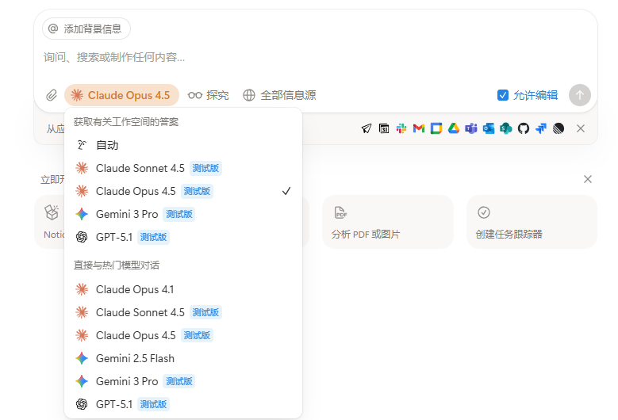
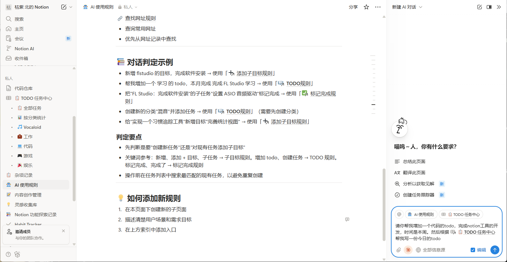

# Notion 同步工具使用指南

> 将本地代码与 Notion 双向同步，借助 Notion AI 提升开发效率





---

## 一、为什么选择 Notion？

### 1.1 Notion 的核心优势

| 优势 | 说明 |
|------|------|
| 🤖 **内置 AI 助手** | Notion AI 可以帮助生成、优化、解释代码，无需切换工具 |
| 📱 **全平台同步** | Web、Windows、Mac、iOS、Android 全覆盖，随时随地访问 |
| 🔗 **强大的链接系统** | 页面之间可以相互引用，构建知识网络 |
| 👥 **实时协作** | 多人同时编辑，评论讨论，适合团队协作 |
| 📊 **灵活的数据库** | 可以创建任务看板、文档库、知识库等 |
| 🎨 **美观的界面** | 所见即所得，代码高亮支持多种语言 |
| 🔒 **版本历史** | 自动保存修改历史，可随时回溯 |
| 🌐 **API 支持** | 开放 API，可以编程操作，实现自动化 |

### 1.2 Notion AI 能做什么？

- ✨ **解释代码**：选中代码块，让 AI 解释逻辑和功能
- 🔧 **优化代码**：让 AI 帮你重构、优化性能、修复 bug
- 📝 **生成文档**：自动为代码生成注释和文档
- 💡 **补全功能**：描述需求，让 AI 帮你生成代码
- 🔍 **代码审查**：让 AI 检查代码问题和改进建议
- 🌍 **翻译代码**：将代码从一种语言转换为另一种

---

## 二、同步工具介绍

本工具包含两个脚本，实现本地代码与 Notion 的双向同步：

| 脚本 | 功能 | 命令 |
|------|------|------|
| `notion_push.py` | 本地 → Notion | `python notion_push.py` |
| `notion_pull.py` | Notion → 本地 | `python notion_pull.py` |

### 2.1 主要特性

- ✅ **增量同步**：只同步有变化的文件，节省时间和 API 调用
- ✅ **全量同步**：使用 `--full` 参数强制同步所有文件
- ✅ **自动分块**：长文件自动分割为多个代码块，绕过 API 限制
- ✅ **状态追踪**：通过 hash 值追踪文件变化
- ✅ **文件图标**：不同类型文件显示不同 emoji 图标
- ✅ **排除规则**：可配置排除 `.git`、`node_modules` 等目录

---

## 三、快速开始

### 3.1 安装依赖

```bash
pip install requests
```

### 3.2 配置 Notion

1. **创建集成**
   - 访问 https://www.notion.so/my-integrations
   - 点击「New integration」创建新集成
   - 复制 `Integration Secret`

2. **获取页面 ID**
   - 打开你的 Notion 页面
   - 从 URL 复制页面 ID（32位字符串）
   - 例如：`https://notion.so/MyPage-abc123...` 中的 `abc123...`

3. **授权集成**
   - 在目标页面点击右上角 `...` → `Connections`
   - 添加你创建的集成

4. **编辑配置文件**

首次运行脚本会自动创建 `.config/notion_sync.json`，编辑填入：

```json
{
    "notion": {
        "integration_secret": "你的集成密钥",
        "parent_page_id": "目标页面ID"
    },
    "sync": {
        "file_extensions": [".py", ".md", ".json", ".txt"],
        "exclude_patterns": [".git/**", "__pycache__/**", ".venv/**"],
        "max_file_size_kb": 500
    }
}
```

### 3.3 使用命令

```bash
# 上传到 Notion（增量）
python myscript/notion_push.py

# 上传到 Notion（全量，清空后重新上传）
python myscript/notion_push.py --full

# 从 Notion 拉取（增量）
python myscript/notion_pull.py

# 从 Notion 拉取（全量）
python myscript/notion_pull.py --full
```

---

## 四、工作流程：借助 Notion AI 提效

### 4.1 典型工作流

```
┌─────────────┐     push      ┌─────────────┐
│  本地代码    │ ──────────→  │   Notion    │
│  (IDE编辑)   │              │  (AI辅助)   │
└─────────────┘              └─────────────┘
       ↑                            │
       │          pull              │
       └────────────────────────────┘
```

### 4.2 实战场景

#### 场景 1：让 AI 帮你写代码

1. 在本地创建一个空文件或写好框架
2. 运行 `notion_push.py` 上传到 Notion
3. 在 Notion 中选中代码，使用 AI：
   - 「帮我补全这个函数」
   - 「添加错误处理」
   - 「添加详细注释」
4. 运行 `notion_pull.py` 拉取 AI 修改后的代码

#### 场景 2：代码审查和优化

1. 将现有代码推送到 Notion
2. 让 Notion AI 审查：
   - 「检查这段代码有什么问题」
   - 「如何优化性能」
   - 「有什么安全隐患」
3. AI 会直接修改代码或给出建议
4. 拉取优化后的版本

#### 场景 3：代码解释和文档生成

1. 推送复杂代码到 Notion
2. 让 AI 生成文档：
   - 「解释这段代码的功能」
   - 「生成 API 文档」
   - 「添加使用示例」
3. 文档和代码都保存在 Notion 中

#### 场景 4：学习和重构

1. 推送别人的代码到 Notion
2. 让 AI 帮助理解：
   - 「用简单的语言解释这段代码」
   - 「这个算法的时间复杂度是多少」
   - 「如何用更现代的方式重写」

### 4.3 效率提升技巧

| 技巧 | 说明 |
|------|------|
| 🎯 **批量处理** | 一次推送多个文件，统一在 Notion 处理 |
| 📋 **模板化** | 在 Notion 创建代码模板，AI 根据模板生成 |
| 🔄 **迭代优化** | push → AI修改 → pull → 本地测试 → 再push |
| 📱 **移动办公** | 通勤时用手机在 Notion 让 AI 写代码 |
| 👥 **团队协作** | 共享 Notion 页面，多人协作开发 |

---

## 五、脚本源码

### 5.1 notion_push.py（上传脚本）

<details>
<summary>📄 点击展开/收起代码</summary>

```python
"""
Notion 上传工具 - 将本地文件上传到 Notion
支持增量上传（只上传有变化的文件）

使用: 
  python notion_push.py           # 增量上传
  python notion_push.py --full    # 全量上传（清空后重新上传）
  python notion_push.py [目录]    # 指定目录
"""
import json
import sys
import hashlib
import fnmatch
import requests
from pathlib import Path
from datetime import datetime

SCRIPT_DIR = Path(__file__).parent
CONFIG_NAME = "notion_sync.json"
STATE_NAME = ".notion_sync_state.json"

# 默认配置模板
DEFAULT_CONFIG = {
    "notion": {
        "integration_secret": "your_integration_secret_here",
        "parent_page_id": "your_parent_page_id_here"
    },
    "sync": {
        "source_dir": ".",
        "output_dir": ".",
        "file_extensions": [".py", ".md", ".json", ".txt", ".js", ".ts", ".html", ".css", ".yaml", ".yml", ".sh", ".bat"],
        "exclude_patterns": [
            ".git", ".git/**",
            "__pycache__", "__pycache__/**", "*.pyc",
            ".venv", ".venv/**", "venv", "venv/**",
            "node_modules", "node_modules/**",
            ".vscode", ".idea",
            "*.egg-info", "build", "dist",
            ".DS_Store", "*.log",
            "assets", "assets/**",
            ".config/*.json"
        ],
        "max_file_size_kb": 500
    },
    "icons": {
        ".py": "🐍", ".js": "📜", ".ts": "📘", ".md": "📝",
        ".json": "📋", ".html": "🌐", ".css": "🎨",
        ".yaml": "⚙️", ".yml": "⚙️", ".txt": "📄",
        ".sh": "🔧", ".bat": "🔧",
        "folder": "📁", "default": "📄"
    }
}


def find_project_root() -> Path:
    """向上查找包含 .config 目录的项目根目录"""
    current = SCRIPT_DIR
    for _ in range(10):
        # 查找新配置文件名或旧配置文件名
        if (current / ".config" / CONFIG_NAME).exists():
            return current
        if (current / ".config" / "sync_config.json").exists():
            return current
        if (current / ".config").exists():
            return current
        parent = current.parent
        if parent == current:
            break
        current = parent
    return SCRIPT_DIR.parent


PROJECT_ROOT = find_project_root()
CONFIG_DIR = PROJECT_ROOT / ".config"
CONFIG_PATH = CONFIG_DIR / CONFIG_NAME
OLD_CONFIG_PATH = CONFIG_DIR / "sync_config.json"
STATE_PATH = PROJECT_ROOT / STATE_NAME


def ensure_config() -> dict:
    """确保配置文件存在，不存在则创建"""
    # 优先使用新配置文件
    if CONFIG_PATH.exists():
        with open(CONFIG_PATH, 'r', encoding='utf-8') as f:
            return json.load(f)
    
    # 兼容旧配置文件
    if OLD_CONFIG_PATH.exists():
        with open(OLD_CONFIG_PATH, 'r', encoding='utf-8') as f:
            config = json.load(f)
        # 迁移到新文件名
        print(f"📦 迁移配置文件: sync_config.json → {CONFIG_NAME}")
        with open(CONFIG_PATH, 'w', encoding='utf-8') as f:
            json.dump(config, f, indent=4, ensure_ascii=False)
        return config
    
    # 创建默认配置
    CONFIG_DIR.mkdir(parents=True, exist_ok=True)
    with open(CONFIG_PATH, 'w', encoding='utf-8') as f:
        json.dump(DEFAULT_CONFIG, f, indent=4, ensure_ascii=False)
    
    print(f"📝 已创建配置文件: {CONFIG_PATH}")
    print()
    print("⚠️  请编辑配置文件，填入你的 Notion 信息：")
    print(f"   1. integration_secret: Notion 集成密钥")
    print(f"   2. parent_page_id: 目标页面 ID")
    print()
    print("   获取方式：")
    print("   - 打开 https://www.notion.so/my-integrations 创建集成")
    print("   - 打开目标页面，从 URL 复制页面 ID")
    sys.exit(0)


def load_state() -> dict:
    """加载同步状态"""
    if STATE_PATH.exists():
        try:
            with open(STATE_PATH, 'r', encoding='utf-8') as f:
                return json.load(f)
        except:
            pass
    return {"files": {}, "last_sync": None}


def save_state(state: dict):
    """保存同步状态"""
    state["last_sync"] = datetime.now().isoformat()
    with open(STATE_PATH, 'w', encoding='utf-8') as f:
        json.dump(state, f, indent=2, ensure_ascii=False)


def file_hash(filepath: Path) -> str:
    """计算文件内容的 MD5 哈希"""
    try:
        with open(filepath, 'rb') as f:
            return hashlib.md5(f.read()).hexdigest()
    except:
        return ""


class NotionAPI:
    BASE_URL = "https://api.notion.com/v1"
    
    def __init__(self, secret: str):
        self.headers = {
            "Authorization": f"Bearer {secret}",
            "Content-Type": "application/json",
            "Notion-Version": "2022-06-28"
        }
    
    def get_block_children(self, block_id: str) -> list:
        all_blocks = []
        has_more = True
        start_cursor = None
        
        while has_more:
            params = {"page_size": 100}
            if start_cursor:
                params["start_cursor"] = start_cursor
            
            response = requests.get(
                f"{self.BASE_URL}/blocks/{block_id}/children",
                headers=self.headers,
                params=params
            )
            
            if response.status_code == 200:
                data = response.json()
                all_blocks.extend(data.get('results', []))
                has_more = data.get('has_more', False)
                start_cursor = data.get('next_cursor')
            else:
                break
        
        return all_blocks
    
    def delete_block(self, block_id: str) -> bool:
        response = requests.delete(
            f"{self.BASE_URL}/blocks/{block_id}",
            headers=self.headers
        )
        return response.status_code == 200
    
    def append_blocks(self, parent_id: str, blocks: list) -> bool:
        if not blocks:
            return True
        
        response = requests.patch(
            f"{self.BASE_URL}/blocks/{parent_id}/children",
            headers=self.headers,
            json={"children": blocks}
        )
        return response.status_code == 200
    
    def create_page(self, parent_id: str, title: str, icon: str = "📄") -> dict:
        """创建空页面"""
        payload = {
            "parent": {"page_id": parent_id},
            "icon": {"type": "emoji", "emoji": icon},
            "properties": {
                "title": {"title": [{"type": "text", "text": {"content": title}}]}
            }
        }
        
        response = requests.post(
            f"{self.BASE_URL}/pages",
            headers=self.headers,
            json=payload
        )
        
        if response.status_code == 200:
            return response.json()
        else:
            print(f"   ❌ 创建失败: {response.status_code} - {response.text[:200]}")
            return {}
    
    def update_page_content(self, page_id: str, content: str, lang: str):
        """更新页面内容（先清空再添加）"""
        # 清空页面内容
        blocks = self.get_block_children(page_id)
        for block in blocks:
            self.delete_block(block['id'])
        
        # 添加新内容
        self.upload_file_content(page_id, content, lang)
    
    def clear_page(self, page_id: str) -> int:
        blocks = self.get_block_children(page_id)
        deleted = 0
        for block in blocks:
            if self.delete_block(block['id']):
                deleted += 1
        return deleted
    
    def upload_file_content(self, page_id: str, content: str, lang: str = "plain text"):
        """上传文件内容到页面（分块处理长内容）"""
        MAX_CHUNK = 1800
        
        if len(content) <= MAX_CHUNK:
            blocks = [self._code_block(content, lang)]
            self.append_blocks(page_id, blocks)
        else:
            chunks = self._split_by_lines(content, MAX_CHUNK)
            for i in range(0, len(chunks), 50):
                batch = chunks[i:i+50]
                blocks = [self._code_block(chunk, lang) for chunk in batch]
                self.append_blocks(page_id, blocks)
    
    def _split_by_lines(self, content: str, max_len: int) -> list:
        chunks = []
        lines = content.split('\n')
        current = []
        current_len = 0
        
        for line in lines:
            line_len = len(line) + 1
            if current_len + line_len > max_len and current:
                chunks.append('\n'.join(current))
                current = [line]
                current_len = line_len
            else:
                current.append(line)
                current_len += line_len
        
        if current:
            chunks.append('\n'.join(current))
        
        return chunks
    
    def _code_block(self, content: str, lang: str) -> dict:
        lang_map = {
            'py': 'python', 'js': 'javascript', 'ts': 'typescript',
            'sh': 'bash', 'yml': 'yaml', 'md': 'markdown',
            'txt': 'plain text', 'text': 'plain text'
        }
        notion_lang = lang_map.get(lang, lang) if lang else 'plain text'
        
        return {
            "object": "block",
            "type": "code",
            "code": {
                "rich_text": [{"type": "text", "text": {"content": content}}],
                "language": notion_lang
            }
        }


class FileScanner:
    def __init__(self, config: dict):
        self.config = config['sync']
        self.icons = config.get('icons', {})
    
    def should_exclude(self, path: Path, base_dir: Path) -> bool:
        rel_str = str(path.relative_to(base_dir)).replace('\\', '/')
        name = path.name
        
        for pattern in self.config.get('exclude_patterns', []):
            if fnmatch.fnmatch(name, pattern):
                return True
            if fnmatch.fnmatch(rel_str, pattern):
                return True
            if '**' in pattern:
                base = pattern.replace('/**', '').replace('**/', '')
                if rel_str.startswith(base + '/') or rel_str == base:
                    return True
        return False
    
    def should_include(self, path: Path) -> bool:
        exts = self.config.get('file_extensions', [])
        return not exts or path.suffix.lower() in exts
    
    def get_icon(self, path: Path) -> str:
        if path.is_dir():
            return self.icons.get('folder', '📁')
        return self.icons.get(path.suffix.lower(), self.icons.get('default', '📄'))
    
    def scan(self, base_dir: Path) -> list:
        max_size = self.config.get('max_file_size_kb', 500) * 1024
        files = []
        
        for item in sorted(base_dir.rglob('*')):
            if item.is_file():
                if self.should_exclude(item, base_dir):
                    continue
                if not self.should_include(item):
                    continue
                try:
                    if item.stat().st_size <= max_size:
                        files.append(item)
                except:
                    pass
        
        return files


def push(source_dir: Path = None, full_sync: bool = False):
    config = ensure_config()
    
    # 检查配置是否有效
    secret = config['notion']['integration_secret']
    parent_id = config['notion']['parent_page_id']
    
    if secret == "your_integration_secret_here" or parent_id == "your_parent_page_id_here":
        print("❌ 请先编辑配置文件，填入 Notion 信息")
        print(f"   配置文件: {CONFIG_PATH}")
        sys.exit(1)
    
    api = NotionAPI(secret)
    scanner = FileScanner(config)
    state = load_state()
    
    if source_dir is None:
        source_dir = PROJECT_ROOT
    source_dir = source_dir.resolve()
    
    print("=" * 50)
    print("📤 上传到 Notion" + (" (全量)" if full_sync else " (增量)"))
    print("=" * 50)
    print(f"📂 源: {source_dir}")
    print(f"🎯 目标: {parent_id}")
    if state.get("last_sync"):
        print(f"🕐 上次同步: {state['last_sync']}")
    print()
    
    # 扫描文件
    print("🔍 扫描文件...")
    files = scanner.scan(source_dir)
    print(f"   找到 {len(files)} 个文件")
    print()
    
    if not files:
        print("📭 没有文件")
        return
    
    # 全量同步：清空后重新上传
    if full_sync:
        print("🧹 清空目标页面...")
        deleted = api.clear_page(parent_id)
        print(f"   删除 {deleted} 个块")
        state["files"] = {}  # 清空状态
        print()
    
    # 分析变化
    file_states = state.get("files", {})
    to_create = []  # 新文件
    to_update = []  # 修改的文件
    unchanged = []  # 未变化
    
    for filepath in files:
        rel_path = str(filepath.relative_to(source_dir)).replace('\\', '/')
        current_hash = file_hash(filepath)
        
        if rel_path not in file_states:
            to_create.append((filepath, rel_path, current_hash))
        elif file_states[rel_path].get("hash") != current_hash:
            to_update.append((filepath, rel_path, current_hash, file_states[rel_path].get("page_id")))
        else:
            unchanged.append(rel_path)
    
    # 检测删除的文件
    current_files = {str(f.relative_to(source_dir)).replace('\\', '/') for f in files}
    deleted_files = [f for f in file_states.keys() if f not in current_files]
    
    print(f"📊 变化统计:")
    print(f"   新增: {len(to_create)}")
    print(f"   修改: {len(to_update)}")
    print(f"   删除: {len(deleted_files)}")
    print(f"   未变: {len(unchanged)}")
    print()
    
    if not to_create and not to_update and not deleted_files:
        print("✅ 没有变化，无需同步")
        return
    
    # 处理删除
    for rel_path in deleted_files:
        page_id = file_states[rel_path].get("page_id")
        if page_id:
            print(f"🗑️ 删除: {rel_path}")
            api.delete_block(page_id)
        del file_states[rel_path]
    
    # 处理新增
    success = 0
    for filepath, rel_path, hash_val in to_create:
        icon = scanner.get_icon(filepath)
        print(f"➕ 新增: {rel_path}")
        
        try:
            with open(filepath, 'r', encoding='utf-8', errors='ignore') as f:
                content = f.read()
            
            page = api.create_page(parent_id, rel_path, icon)
            if page:
                page_id = page['id']
                lang = filepath.suffix.lstrip('.') or 'text'
                api.upload_file_content(page_id, content, lang)
                
                file_states[rel_path] = {
                    "hash": hash_val,
                    "page_id": page_id,
                    "synced_at": datetime.now().isoformat()
                }
                print(f"   ✅ 成功")
                success += 1
        except Exception as e:
            print(f"   ❌ 错误: {e}")
    
    # 处理更新
    for filepath, rel_path, hash_val, page_id in to_update:
        print(f"📝 更新: {rel_path}")
        
        try:
            with open(filepath, 'r', encoding='utf-8', errors='ignore') as f:
                content = f.read()
            
            if page_id:
                lang = filepath.suffix.lstrip('.') or 'text'
                api.update_page_content(page_id, content, lang)
                
                file_states[rel_path]["hash"] = hash_val
                file_states[rel_path]["synced_at"] = datetime.now().isoformat()
                print(f"   ✅ 成功")
                success += 1
            else:
                print(f"   ⚠️ 页面 ID 丢失，跳过")
        except Exception as e:
            print(f"   ❌ 错误: {e}")
    
    # 保存状态
    state["files"] = file_states
    save_state(state)
    
    print()
    print("=" * 50)
    total_changes = len(to_create) + len(to_update) + len(deleted_files)
    print(f"✅ 完成! 处理 {success}/{total_changes} 个变化")
    print(f"🔗 https://notion.so/{parent_id.replace('-', '')}")


if __name__ == "__main__":
    args = sys.argv[1:]
    full_sync = "--full" in args
    args = [a for a in args if a != "--full"]
    
    source = Path(args[0]).resolve() if args else None
    push(source, full_sync)
```

</details>

### 5.2 notion_pull.py（拉取脚本）

<details>
<summary>📄 点击展开/收起代码</summary>

```python
"""
Notion 拉取工具 - 从 Notion 拉取文件到本地
支持增量拉取（只拉取有变化的文件）

使用:
  python notion_pull.py           # 增量拉取到项目根目录
  python notion_pull.py --full    # 全量拉取（覆盖所有）
  python notion_pull.py [目录]    # 指定输出目录
"""
import json
import sys
import hashlib
import requests
from pathlib import Path
from datetime import datetime

SCRIPT_DIR = Path(__file__).parent
CONFIG_NAME = "notion_sync.json"
STATE_NAME = ".notion_sync_state.json"

# 默认配置模板
DEFAULT_CONFIG = {
    "notion": {
        "integration_secret": "your_integration_secret_here",
        "parent_page_id": "your_parent_page_id_here"
    },
    "sync": {
        "source_dir": ".",
        "output_dir": ".",
        "file_extensions": [".py", ".md", ".json", ".txt", ".js", ".ts", ".html", ".css", ".yaml", ".yml", ".sh", ".bat"],
        "exclude_patterns": [
            ".git", ".git/**",
            "__pycache__", "__pycache__/**", "*.pyc",
            ".venv", ".venv/**", "venv", "venv/**",
            "node_modules", "node_modules/**",
            ".vscode", ".idea",
            "*.egg-info", "build", "dist",
            ".DS_Store", "*.log",
            "assets", "assets/**",
            ".config/*.json"
        ],
        "max_file_size_kb": 500
    },
    "icons": {
        ".py": "🐍", ".js": "📜", ".ts": "📘", ".md": "📝",
        ".json": "📋", ".html": "🌐", ".css": "🎨",
        ".yaml": "⚙️", ".yml": "⚙️", ".txt": "📄",
        ".sh": "🔧", ".bat": "🔧",
        "folder": "📁", "default": "📄"
    }
}


def find_project_root() -> Path:
    """向上查找包含 .config 目录的项目根目录"""
    current = SCRIPT_DIR
    for _ in range(10):
        if (current / ".config" / CONFIG_NAME).exists():
            return current
        if (current / ".config" / "sync_config.json").exists():
            return current
        if (current / ".config").exists():
            return current
        parent = current.parent
        if parent == current:
            break
        current = parent
    return SCRIPT_DIR.parent


PROJECT_ROOT = find_project_root()
CONFIG_DIR = PROJECT_ROOT / ".config"
CONFIG_PATH = CONFIG_DIR / CONFIG_NAME
OLD_CONFIG_PATH = CONFIG_DIR / "sync_config.json"
STATE_PATH = PROJECT_ROOT / STATE_NAME


def ensure_config() -> dict:
    """确保配置文件存在"""
    if CONFIG_PATH.exists():
        with open(CONFIG_PATH, 'r', encoding='utf-8') as f:
            return json.load(f)
    
    if OLD_CONFIG_PATH.exists():
        with open(OLD_CONFIG_PATH, 'r', encoding='utf-8') as f:
            config = json.load(f)
        print(f"📦 迁移配置文件: sync_config.json → {CONFIG_NAME}")
        with open(CONFIG_PATH, 'w', encoding='utf-8') as f:
            json.dump(config, f, indent=4, ensure_ascii=False)
        return config
    
    CONFIG_DIR.mkdir(parents=True, exist_ok=True)
    with open(CONFIG_PATH, 'w', encoding='utf-8') as f:
        json.dump(DEFAULT_CONFIG, f, indent=4, ensure_ascii=False)
    
    print(f"📝 已创建配置文件: {CONFIG_PATH}")
    print("⚠️  请先编辑配置文件，填入 Notion 信息")
    sys.exit(0)


def load_state() -> dict:
    """加载同步状态"""
    if STATE_PATH.exists():
        try:
            with open(STATE_PATH, 'r', encoding='utf-8') as f:
                return json.load(f)
        except:
            pass
    return {"files": {}, "last_sync": None}


def save_state(state: dict):
    """保存同步状态"""
    state["last_sync"] = datetime.now().isoformat()
    with open(STATE_PATH, 'w', encoding='utf-8') as f:
        json.dump(state, f, indent=2, ensure_ascii=False)


def content_hash(content: str) -> str:
    """计算内容的 MD5 哈希"""
    return hashlib.md5(content.encode('utf-8')).hexdigest()


class NotionAPI:
    BASE_URL = "https://api.notion.com/v1"
    
    def __init__(self, secret: str):
        self.headers = {
            "Authorization": f"Bearer {secret}",
            "Content-Type": "application/json",
            "Notion-Version": "2022-06-28"
        }
    
    def get_page(self, page_id: str) -> dict:
        """获取页面信息（包含最后编辑时间）"""
        response = requests.get(
            f"{self.BASE_URL}/pages/{page_id}",
            headers=self.headers
        )
        if response.status_code == 200:
            return response.json()
        return {}
    
    def get_block_children(self, block_id: str) -> list:
        all_blocks = []
        has_more = True
        start_cursor = None
        
        while has_more:
            params = {"page_size": 100}
            if start_cursor:
                params["start_cursor"] = start_cursor
            
            response = requests.get(
                f"{self.BASE_URL}/blocks/{block_id}/children",
                headers=self.headers,
                params=params
            )
            
            if response.status_code == 200:
                data = response.json()
                all_blocks.extend(data.get('results', []))
                has_more = data.get('has_more', False)
                start_cursor = data.get('next_cursor')
            else:
                break
        
        return all_blocks
    
    def extract_code_from_page(self, page_id: str) -> str:
        """从页面中提取所有代码块内容并合并"""
        blocks = self.get_block_children(page_id)
        code_parts = []
        
        for block in blocks:
            block_type = block.get('type', '')
            
            if block_type == 'code':
                block_data = block.get('code', {})
                rich_text = block_data.get('rich_text', [])
                code_text = ''.join(item.get('plain_text', '') for item in rich_text)
                if code_text:
                    code_parts.append(code_text)
        
        return '\n'.join(code_parts)


def pull(output_dir: Path = None, full_sync: bool = False):
    config = ensure_config()
    
    secret = config['notion']['integration_secret']
    parent_id = config['notion']['parent_page_id']
    
    if secret == "your_integration_secret_here" or parent_id == "your_parent_page_id_here":
        print("❌ 请先编辑配置文件，填入 Notion 信息")
        print(f"   配置文件: {CONFIG_PATH}")
        sys.exit(1)
    
    api = NotionAPI(secret)
    state = load_state()
    
    if output_dir is None:
        output_dir = PROJECT_ROOT
    output_dir = output_dir.resolve()
    
    print("=" * 50)
    print("📥 从 Notion 拉取" + (" (全量)" if full_sync else " (增量)"))
    print("=" * 50)
    print(f"🎯 源: {parent_id}")
    print(f"📂 输出: {output_dir}")
    if state.get("last_sync"):
        print(f"🕐 上次同步: {state['last_sync']}")
    print()
    
    # 获取所有子页面
    print("🔍 获取页面列表...")
    blocks = api.get_block_children(parent_id)
    pages = [b for b in blocks if b['type'] == 'child_page']
    
    if not pages:
        print("📭 没有找到页面")
        return
    
    print(f"   找到 {len(pages)} 个文件")
    print()
    
    file_states = state.get("files", {})
    to_update = []
    unchanged = []
    
    # 分析变化（需要获取每个页面的真实修改时间）
    print("🔍 检查页面变化...")
    for page in pages:
        page_id = page['id']
        title = page['child_page']['title']
        
        # 获取页面详情以得到准确的 last_edited_time
        page_info = api.get_page(page_id)
        last_edited = page_info.get('last_edited_time', '')
        
        if full_sync:
            to_update.append((page_id, title, last_edited))
        elif title not in file_states:
            # 新页面
            to_update.append((page_id, title, last_edited))
        elif file_states[title].get("last_edited") != last_edited:
            # 页面有修改
            to_update.append((page_id, title, last_edited))
        else:
            unchanged.append(title)
    
    print(f"📊 变化统计:")
    print(f"   需更新: {len(to_update)}")
    print(f"   未变化: {len(unchanged)}")
    print()
    
    if not to_update:
        print("✅ 没有变化，无需同步")
        return
    
    # 拉取更新
    print("📥 开始拉取...")
    success = 0
    
    for page_id, title, last_edited in to_update:
        print(f"📄 {title}")
        
        try:
            content = api.extract_code_from_page(page_id)
            
            if not content:
                print(f"   ⚠️ 内容为空，跳过")
                continue
            
            filepath = output_dir / title
            filepath.parent.mkdir(parents=True, exist_ok=True)
            
            with open(filepath, 'w', encoding='utf-8') as f:
                f.write(content)
            
            # 更新状态
            file_states[title] = {
                "page_id": page_id,
                "hash": content_hash(content),
                "last_edited": last_edited,
                "synced_at": datetime.now().isoformat()
            }
            
            print(f"   ✅ 已保存 ({len(content)} 字符)")
            success += 1
            
        except Exception as e:
            print(f"   ❌ 错误: {e}")
    
    # 保存状态
    state["files"] = file_states
    save_state(state)
    
    print()
    print("=" * 50)
    print(f"✅ 完成! 更新 {success}/{len(to_update)} 个文件")


if __name__ == "__main__":
    args = sys.argv[1:]
    full_sync = "--full" in args
    args = [a for a in args if a != "--full"]
    
    output = Path(args[0]).resolve() if args else None
    pull(output, full_sync)
```

</details>

---

## 六、常见问题

### Q1: 为什么拉取的文件内容为空？

可能原因：
- Notion 页面中没有代码块（只有普通文本）
- 代码块语言类型不被支持（已在最新版本修复 `.txt` 问题）

解决：确保在 Notion 中使用代码块存储内容

### Q2: 如何只同步特定文件？

修改 `.config/notion_sync.json` 中的配置：

```json
{
    "sync": {
        "file_extensions": [".py"],  // 只同步 Python 文件
        "exclude_patterns": ["test_*"]  // 排除测试文件
    }
}
```

### Q3: 文件太大无法上传？

调整 `max_file_size_kb` 配置，或将大文件添加到排除列表

### Q4: 如何解决冲突？

使用 `--full` 参数强制覆盖：
- `notion_push.py --full`：以本地为准
- `notion_pull.py --full`：以 Notion 为准

---

## 七、总结

通过这套工具，你可以：

1. **本地开发** → push → **Notion AI 优化** → pull → **本地使用**
2. 随时随地用手机查看和编辑代码
3. 让 AI 帮你写代码、写文档、做审查
4. 团队共享代码，协作开发

开始使用吧！🚀
