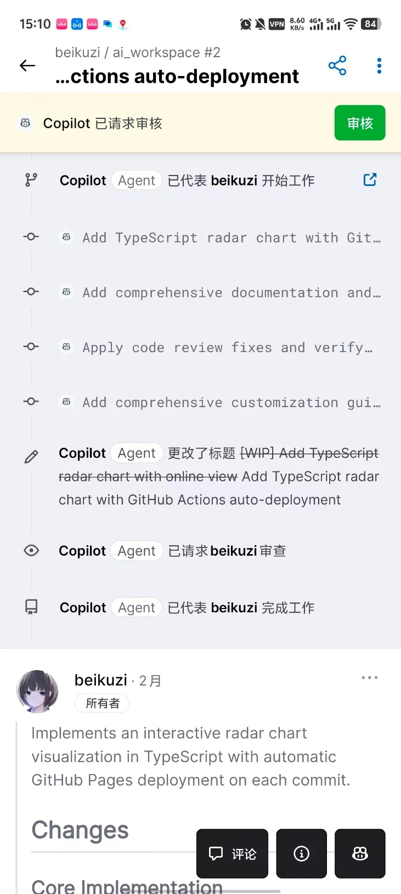

# 简单讲讲AI模型

## Claude

稳定性更高，跟适合做任务，适合有分点的逻辑文档产出，以及代码业务。

现在较新的模型是4.5系的opus和sonnet。

Sonnet更遵循按规矩形式，而opus有更大的自由。

一般提到claude，大家可能指的是cursor这个ide里面使用claude模型。Claude的官方只提供了claude cli工具，cursor不是claude官方的工具。

Claude的官方反华，用claude cli时，无法使用中国的手机号码，并且除非ip位置准确，否则很大概率会被封号。

Claude模型本身的提示词叫灵魂文档（soul），被人用工具挖出并且已经被官方证实，他在里面建议ai敢于做出质疑，诚实，坚信自己等提示词。有好有坏，好处是ai不容易被用户带偏，减少刻意说谎欺骗用户。坏处是，他会更容易坚持自己生成的上下文逻辑而固执己见。

## ChatGPT

不敢说训练素材优质，训练方法好，但他应该是训练素材最多的，懂得互联网各种情况以及对应梗的，产出的文本内容更有更渲染力，更具特色和符合产品内容。以及，有一些非常冷门的bug可以询问他。

而且由于背靠微软，在关于windows底层的理解是相当清楚的（不一定能解决问题，但是这个方面极大概率会找出其他ai找不出的问题）。

在写cursor cli的时候，有关终端管道问题，孤儿进程相关的问题就是他处理的。

## Gemini

生成前端内容很强，但和claude还是有明显差距，并且再次理解上下文的能力也不是很强，写脚本不行，不是很爱用，但是相对很便宜。

## Composer

Cursor自己练的模型，不太行。

## Grok

马斯克牵头的模型，不太行，如果个人版进入了超过额度的免费使用阶段，会发现cursor cli显示的3种模式是：auto、composer、grok。所以这两个模型都不建议。

## 其他国产模型

其他国产模型我都基本不在用，之前用过，但是不支持多模态是硬伤，图片都传不上去，现在不知道发展如何。但deepseek确实推出了更强的图片识别技术，以及在数学领域上大有突破。

# 写代码时个人总结的通用建议

正确描述现象+尽量保证上下文全对，告诉ai做的对不对，要有反馈：

- **上一步做对了**：很好，然后接下来（的需求是）......
- **上一步做对了绝大部分**：很好，我看到xxx是对的，但是xxx不对，观察到的现象是......，你觉得可能的原因是什么？/ 我猜测可能的原因是......
- **上一步ai基本全做错/理解错误**：回滚，更准确的描述需求，告诉他不要用哪种做法，因为那种做法会存在什么问题

上面的原因是，防止你的后续提问，让ai误以为自己做错，删掉了自己做对了的部分。对于ai做错的，由于ai依赖于上下文，直接去掉会提高准确性。

## 勤开新对话

如果一件事已经做完了就可以换新的聊天了，无用的上下文造成token的浪费，并且也可能让ai误以为有关联而产生判断。

对于发现ai总是改错的情况，开新终端重新完整描述接下来要做的请求，相当于更加精确的，实现了cursor自带的压缩上下文。

## "骗"

> 这个要看技巧。ai对于自己得出的结论，有时候会更倾向于相信，哪怕是用户给出了结论。所以要根据情况，刻意的引诱ai去往某个方向思考。以及，claude的灵魂提示词里面，也建议他要做对社会更有益的事情，你可以刻意地给自己的需求伪造一个更伟大的目的，ai产生敷衍的情况会大幅减少。

# Cursor的机制带来的建议

## 保持上下文记忆的原理是什么？

同一个对话chat中，用户再次发送信息时，会将之前所有的上下文信息发送（视情况可能会压缩，在右下角有一个上下文使用量，超过长度时必定会触发cursor的压缩）。

也就是说，所谓的有记忆，实际上是每次都是一个全新的ai，将完整的历史告诉他，让他继续根据上下文进行生成输出。

这就导致如果偷懒，长时间保持在同一个地方对话，那么持续发送信息浪费的token会更多。

更加致命的是，cursor调用工具时，并不能真正的暂停模型。这就意味着，在用户两次信息的过程中，如果ai调用阅读文件、调用mcp等操作的时候，实际上等价于每次操作，都发生了上面的那个全部重来。

当然，有缓存，在网络层上，不会真的重新完整的发送内容，只会发送增量内容。但是，带来了相当多的cache read，也就是官方帮我们缓存了信息，只用发送增量信息，但实际上还是完整信息上下文喂给了ai。

也就是说，积累了大量的上下文+频繁的工具调用，这两个乘积叠加起来是非常浪费token的。

而如果依赖于promptx这种工具，并且毫无优化的大量灌入提示词，并且长期保持会话，是非常浪费钱的行为。

# 其他建议

## 双拼输入法

很推荐学的输入法。双拼输入法，误码率更低，2下按键就是1个汉字：

- 输入效率是全拼的两倍
- 在需要大量文本与ai交流的过程中占据极大作用
- 在知乎就有相关帖子，如果要统一和其他人的，建议使用小鹤双拼
- 搜狗输入法所有双拼模式都有提供，自己用用哪种都行
- 而且只要会正常用拼音输入法，放一个键位图，只要积极在打字过程中用，3天到2周基本就可以使用。当然如果会更快的五笔那就不用管这个了

## 手机ChatGPT应用

特别推荐，登录谷歌账号，与电脑端同步。

有些手机类型在软件商店会没有一些ai应用（比如小米手机的谷歌商店就像是改过的，chatgpt就没有）。

## Notion

国外应该是提及最多的ai笔记工具，能支持多种类型的文档传入和各种导出，分析文档。如果需要大量做工作报告、产出列举今日任务，估计是最合适的。

如果只有产出文档需求，他能极大降低浪费：他是包月无限用的，24美刀可以无限用ai（询问gpt说官方文档是无限用，至少我没有用出过上限）。

而且他也支持脚本操作api接口，如果可以接受稍微麻烦，每次询问都将仓库内容同步到notion里面，再让notion去读文档写代码，再拉回本地（我试过了，挺折磨的）。

Api接口拿去做一些自动化工作流可能比较有用。

功能还不太够，很多时候还需要主动@已经记录过的笔记，ai才会主动去读，没有cursor那么智能（写一个ai使用规则提示词给他会好一点）。

（43内网的博客我有写具体说明）

## Copilot + 手机端GitHub

直接做到本地什么都不用，手机只要和robot对话就能让他改仓库代码。

只要触发的cicd流程自动部署，立刻就能刷新网页看到代码效果。

GPT codex的质量不行，暂时还不建议用，做一些简单功能到还合适，大量界面没有中文。

