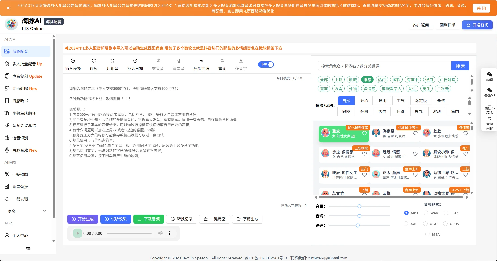
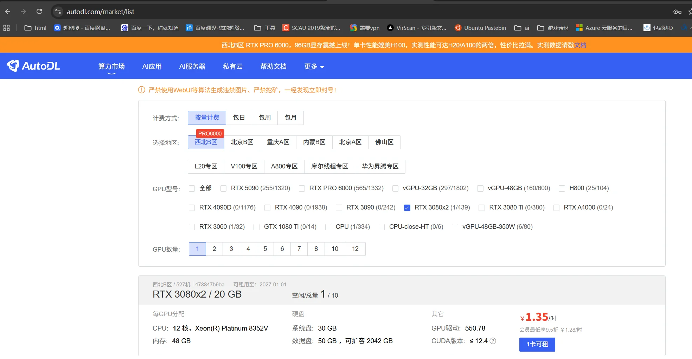
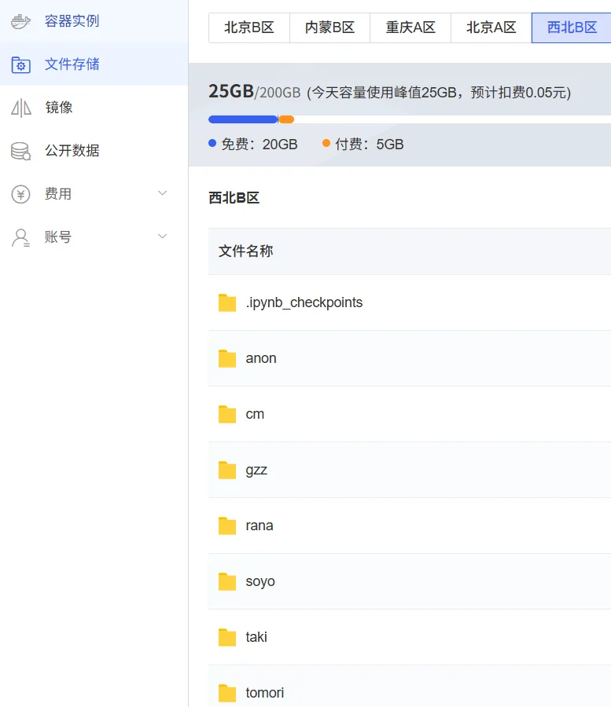
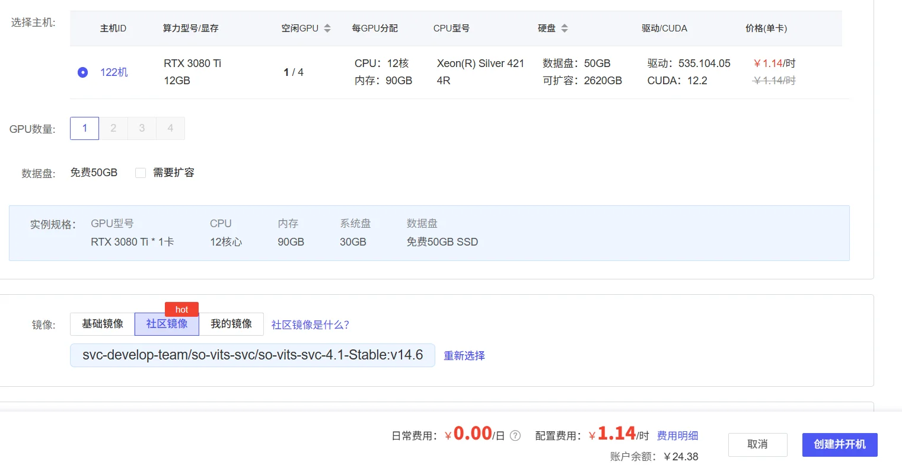
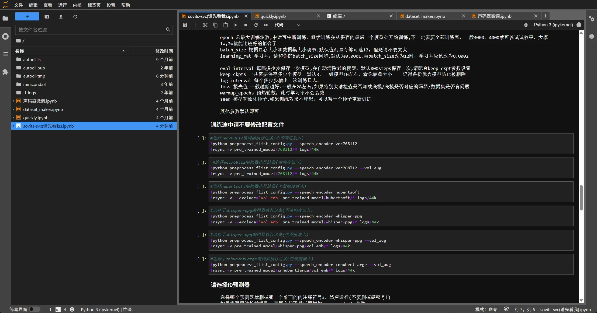
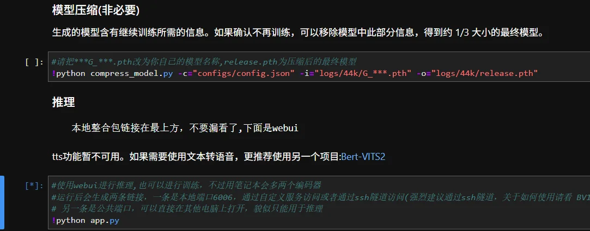
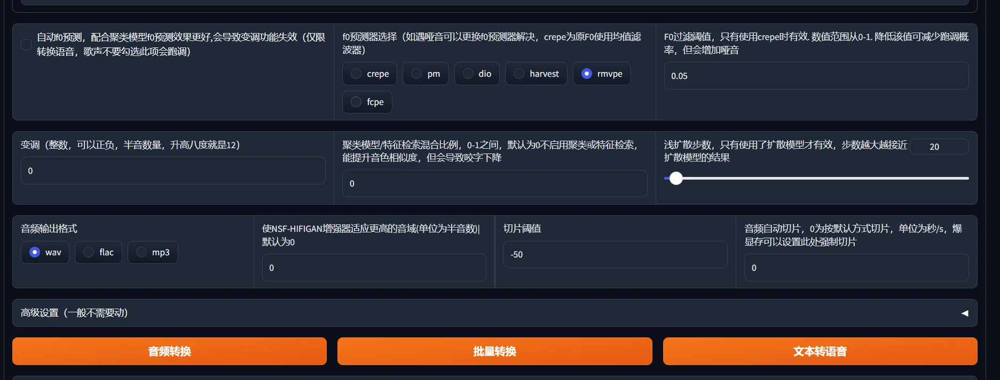

# AI音乐配音类

## TTSON

配音工具，不需要登录就可以使用。

https://www.ttson.cn/

## So-VITS

这是我2年前生成的，个人感觉效果还不错，自己没有做调音操作，但是只靠后处理，让剪映简单混个音，听感就十分不错：

https://github.com/beikuzi/showcase/tree/main/ai%E7%94%9F%E6%88%90/ai%E9%9F%B3%E4%B9%90

### 云显卡平台AutoDL

我用的是云显卡平台AutoDL，国内比较知名的租显卡平台，有很多教程都教使用这个来快速体验AI。

我在大学的时候学生价，租3080也就8毛钱一小时，当然现在贵点。想练一个AI翻唱模型，挂个几小时就练完了，没有特殊需求，按速度和价格，3080性价比相对较高。

现在日常都比较火爆，需要刷新去抢，通常廉价卡在西北B区会容易捡到，如果怕租上去还要花时间上传文件，可以提前先到文件存储上传必要文件。

选择好镜像后开机就可以了。

上面有人家的脚本，有些写的不错的甚至可以直接抄。以及对于流程操作，ipynb的快速操作技巧也是我从上面学到的，可以看我内网的博客。

然后顺带纠正一下这个仓库的问题，他说的TTS不可用，实际上是里面TTS的python文件的依赖没装对，只要将问题发给GPT让他教一下，把依赖更新一下就可以用了。

### 翻唱技巧

翻唱的时候根据歌曲音高来变调，比如让女声模型唱冬之歌的时候，冬之歌是男声且跨的音域较大，不变调就会让女声模型翻唱的特别低沉。以及根据模型训练的效果，可能有些音域难以覆盖到，这时候就要反向调F0过滤值来减少哑音，在crepe和rmvpe预测器之间多尝试几次。以及，只要不是特别高端的显卡（反正3080扛不住会爆显存），就要给音频自动切片来拆分成多段进行翻唱。

### 训练素材

如果要训练，就要去找干净的人声素材（并且素材量要足够多）。

对于文字向游戏，就是依靠剧情+美术+配音为主题的游戏，只要解包就能获得非常多的游戏素材，所以在早期，b站上有大量柚子社相关游戏人声配音与翻唱，并且本身带抽象逆天元素所以快速把这个带火起来。

之后出了快速人声复刻的模型，能做到不需要太多素材就能生成模型。

## GPT-SoVITS

没有用过，似乎没有很好的翻唱功能，但是训练速度更快，拿来配音很快，也提供了实时变声器。
