# AI 美术工作流产品应用场景

这份文档从“能落到哪些项目场景”出发，整理 AI 美术工作流在游戏、内容、运营、社区和内部生产中的典型用法。

产品理解核心逻辑后，看到某个场景时，可以快速判断它适不适合接入 AI，美术工作流能产出什么，以及这个方向有没有继续做成产品能力、活动玩法或内部工具的空间。

---

## 一、社交分享与轻量形象：先让用户愿意发给朋友看

### 段落概述

这是 AI 美术最容易被普通用户感知的一类入口：头像、合影、cos、变装、搭子图和轻量整活。用户不需要理解模型、提示词或美术管线，只要上传一张图、选一个模板，就能得到一张“可以发给朋友看”的结果。

这类场景的价值不在单张图是否达到商用美术精度，而在即时反馈、低门槛参与和短传播路径。用户愿意保存、转发、@好友、发群聊，才说明工作流真正接上了社交关系。对游戏产品尤其合适：角色、身份、好友、公会、队伍、CP、阵营，都是现成的视觉化关系，很适合延展成拍照活动、头像生成器、好友合影工具和搭子关系卡。

### 参考案例

<table>
<tr>
<td align="center" width="33%">
<a href="https://www.bilibili.com/video/BV18xmgBAESA">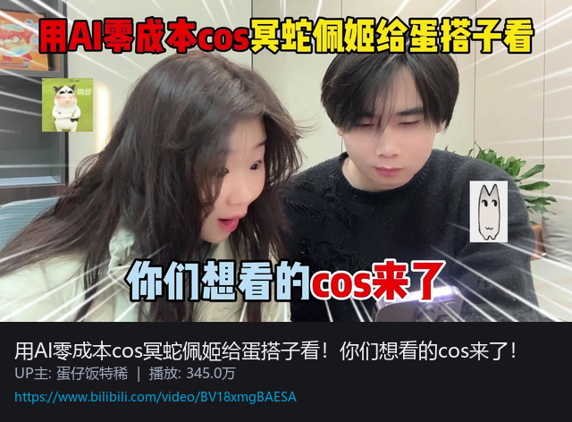</a> 
<a href="https://www.bilibili.com/video/BV18xmgBAESA"><b>AI 零成本 cos · 发给蛋搭子看</b></a>
</td>
<td align="center" width="33%">
<a href="https://www.bilibili.com/video/BV12DVLz6E1q">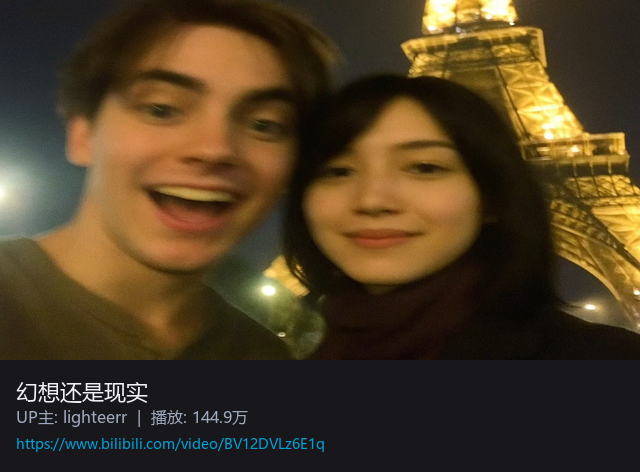</a> 
<a href="https://www.bilibili.com/video/BV12DVLz6E1q"><b>幻想还是现实 · AI 合照</b></a>
</td>
<td align="center" width="33%">
<a href="https://www.bilibili.com/video/BV19p4y1n7Eq">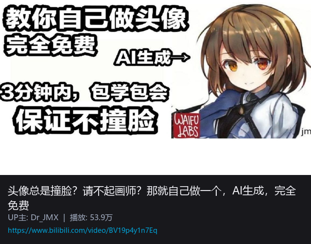</a> 
<a href="https://www.bilibili.com/video/BV19p4y1n7Eq"><b>AI 生成头像 · 完全免费</b></a>
</td>
</tr>
</table>

| 案例 | 传播切入点 | 可借鉴方向 |
|---|---|---|
| [AI 零成本 cos · 发给蛋搭子看](https://www.bilibili.com/video/BV18xmgBAESA) | “发给蛋搭子看”比“生成一张角色图”更明确，核心是好友关系和转发动作。 | 把玩家照片、游戏角色、节日皮肤或阵营身份结合，生成适合私聊、群聊传播的 cos / 变装图。 |
| [幻想还是现实 · AI 合照](https://www.bilibili.com/video/BV12DVLz6E1q) | 用“真假难辨”和“梦幻同框”制造分享理由。 | 二次元角色同框、虚拟偶像合照、玩家与 IP 角色见面、剧情名场面复刻。 |
| [AI 生成头像 · 完全免费](https://www.bilibili.com/video/BV19p4y1n7Eq) | 头像是最低成本的个人表达，换头像即完成一次轻量传播。 | 职业头像、阵营头像、节日头像框、服务器身份头像、战队头像。 |

### 使用场景

| 使用场景 | 具体玩法 | 判断标准 |
|---|---|---|
| 社交头像 | 上传自拍或选择基础形象，生成游戏职业头像、阵营头像、节日头像、像素头像、二次元头像。 | 用户是否愿意替换头像，是否愿意在群里晒图。 |
| 好友 / 搭子合影 | 两人或多人上传照片，生成同框合影、队伍海报、CP 合照、搭子证件照、公会纪念照。 | 结果是否能触发“把你也拉进来生成一张”的邀请动作。 |
| AI cos / 变装 | 把用户转成游戏角色、NPC、Boss、职业身份、节日皮肤或活动主题装扮。 | 模板是否够轻，生成结果是否一眼看懂“我变成了什么”。 |
| 群像关系卡 | 根据好友、公会、小队或部门成员生成职业分工、阵营分配、通缉令、队伍卡。 | 是否能承载熟人关系和群体身份，而不只是单人美图。 |
| 线下活动互动 | 展台拍照后生成角色证件、阵营入场证、纪念海报、与角色同框照。 | 生成速度是否足够快，结果是否适合扫码保存和二次传播。 |
| 节日与版本活动 | 春节、周年庆、愚人节、夏日、万圣节等节点生成主题头像、合影和整活图。 | 是否能快速换主题、换文案、换角色资产，形成连续活动模板。 |

### 典型产出

| 类型 | 典型产出 | 可延展为产品能力 |
|---|---|---|
| 个人形象 | 社交头像、职业头像、阵营头像、节日头像框、个人角色卡、证件照风格图 | 头像生成器、角色身份生成器、玩家形象系统 |
| 关系内容 | 好友合影、搭子合照、公会合影、小队职业卡、CP 同框、角色团建图 | 好友邀请链路、公会活动模板、队伍纪念系统 |
| 轻量整活 | AI cos、变装图、通缉令、阵营分配图、挑战题图、聊天截图式梗图 | 社区挑战活动、群聊传播模板、节日互动工具 |
| 运营素材 | 活动分享长图、线下展台纪念图、玩家投稿模板、UGC 封面模板 | 活动配置后台、模板库、低门槛 UGC 生产工具 |

---

## 二、社区传播：把角色变成可以被转发的内容

### 段落概述

社区传播关注的不是“生成一张漂亮图”，而是把已有角色、活动主题和玩家关系转成更容易被看见、被讨论、被二创的内容：封面、小剧场、表情包、梗图、配音整活和短视频片段。它的核心指标更接近内容产品，而不是传统美术验收：有没有点击欲望，能不能让人看懂梗，是否愿意转发，能不能引出评论和跟做。

这类内容看起来轻，但很适合服务版本预热、社区活动和用户参与。AI 美术工作流可以快速把角色放进不同节目、名场面、反差身份和群聊语境里，让玩家不用读长设定，也能通过一张图或一条短视频感受到“这个角色是活的”。如果第一段偏向“用户自己的形象”，这一段更偏向“官方和社区共同传播角色与世界观”。

### 参考案例

<table>
<tr>
<td align="center" width="33%">
<a href="https://www.bilibili.com/video/BV1Nfr6B8Eqr">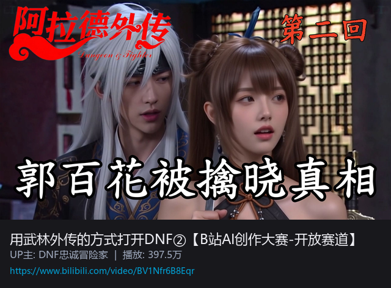</a> 
<a href="https://www.bilibili.com/video/BV1Nfr6B8Eqr"><b>用武林外传的方式打开 DNF②</b></a>
</td>
<td align="center" width="33%">
<a href="https://www.bilibili.com/video/BV16zSEBGEwM">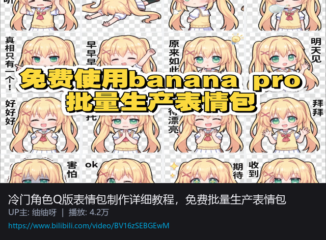</a> 
<a href="https://www.bilibili.com/video/BV16zSEBGEwM"><b>冷门角色Q版表情包制作详细教程，免费批量生产表情包</b></a>
</td>
<td align="center" width="33%">
<a href="https://www.bilibili.com/video/BV1EudEBsEVF">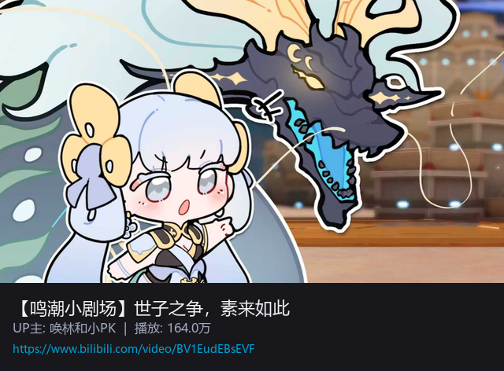</a> 
<a href="https://www.bilibili.com/video/BV1EudEBsEVF"><b>鸣潮小剧场</b></a> 
小剧场动画
</td>
</tr>
</table>

| 案例 | 传播切入点 | 可借鉴方向 |
|---|---|---|
| [用武林外传的方式打开 DNF②](https://www.bilibili.com/video/BV1Nfr6B8Eqr) | 用大众熟悉的剧集语气重讲游戏内容，降低理解门槛，同时制造反差。 | 适合把游戏角色放进经典影视、综艺、职场、江湖、校园等高识别度语境里做二创包装。 |
| [冷门角色Q版表情包制作详细教程，免费批量生产表情包](https://www.bilibili.com/video/BV16zSEBGEwM) | 从冷门角色出发表情包套装，重点不是单张精修，而是可批量生产、可持续补充。 | 适合把角色表情、玩家常用语、版本热梗和社区黑话组合成可下载、可投稿、可扩展的表情包套装。 |
| [鸣潮小剧场](https://www.bilibili.com/video/BV1EudEBsEVF) | 小剧场让角色关系和剧情矛盾变得更轻、更短、更适合刷到即看。 | 适合用 4 格漫画、竖屏分镜、短视频小剧场承接版本预热、角色关系和玩家讨论。 |

### 使用场景

| 使用场景 | 具体玩法 | 判断标准 |
|---|---|---|
| 视频封面与标题图 | 为 B 站、抖音、小红书内容生成高点击率封面、标题字、角色表情和冲突画面。 | 用户是否一眼看懂主题，是否有点击欲望。 |
| 角色整活短视频 | 让角色进入综艺、名场面、直播间、职场、校园、江湖、群聊等反差场景。 | 是否既保留角色识别度，又能形成新的笑点或记忆点。 |
| 剧情小剧场 | 根据角色关系生成 4 格漫画、短篇分镜、竖屏漫剧或轻动态视频。 | 是否能在短时间内交代冲突、包袱和角色关系。 |
| 表情包与梗图 | 将角色表情、台词、玩家黑话、版本热梗组合成可传播素材。 | 是否适合真实聊天场景，是否能被二次使用。 |
| 版本预热内容 | 把新角色、新皮肤、新活动包装成连续短内容，而不是只发一张正式 KV。 | 是否能持续制造讨论点，并把用户导向版本信息。 |
| 社区话题挑战 | 提供统一模板，让玩家投稿自己的梗图、小剧场、角色问答或二创封面。 | 是否足够低门槛，是否容易形成同题创作和接龙传播。 |

### 典型产出

| 类型 | 典型产出 | 可延展为产品能力 |
|---|---|---|
| 内容入口 | 视频封面、标题图、社区帖子配图、短视频首帧 | 社区内容模板、运营封面生成器 |
| 轻量叙事 | 4 格漫画、竖屏分镜、小剧场画面、伪预告片画面 | 版本预热工具、剧情分镜模板 |
| 社区梗图 | 角色表情包、聊天截图式梗图、玩家黑话图、节日整活图 | 表情包工坊、社区投稿活动 |
| 活动模板 | 话题挑战模板、粉丝二创模板、团队海报、公会整活图 | UGC 活动配置、玩家创作模板库 |

---

## 三、奇思妙想 · 风格碰撞：用反差找到新的视觉记忆点

### 段落概述

风格碰撞不是为了把元素混得越怪越好，而是快速验证“两个原本不在一起的东西，能不能融合成一套可识别、可复用、可延展的视觉规则”。它适合用在项目早期、活动包装、IP 联动、短片创意和视觉差异化探索中，帮助团队在常规写实、二次元、卡通之外，先看到一些传统流程里不一定会主动尝试的方向。

这一类内容的关键是“反差之后还能成立”。比如经典游戏换成 90 年代港片气质，现代饮料进入古代叙事，抽象热梗放进古代场景里。它们表面上是脑洞，实际是在测试题材、时代、材质、镜头语言和文化语境能否重新组合。如果组合能沉淀出稳定规则，就不只是整活图，而可能继续延展成角色皮肤、活动主视觉、世界观短片、联动包装或美术参考库。

### 参考案例

<table>
<tr>
<td align="center" width="33%">
<a href="https://www.bilibili.com/video/BV1e7PszQE1Y">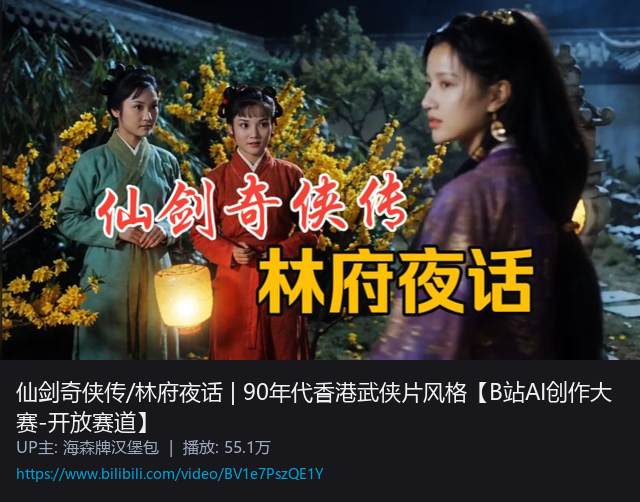</a> 
<a href="https://www.bilibili.com/video/BV1e7PszQE1Y"><b>仙剑 · 90 年代港片风格</b></a>
</td>
<td align="center" width="33%">
<a href="https://www.bilibili.com/video/BV1GRAUzDERo">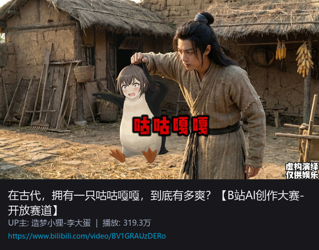</a> 
<a href="https://www.bilibili.com/video/BV1GRAUzDERo"><b>在古代拥有一只咕咕嘎嘎</b></a>
</td>
<td align="center" width="33%">
<a href="https://www.bilibili.com/video/BV19MrhBkEPQ">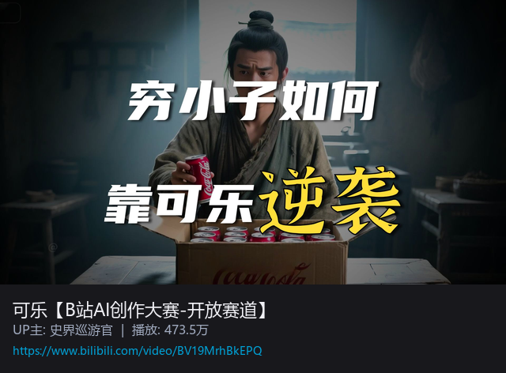</a> 
<a href="https://www.bilibili.com/video/BV19MrhBkEPQ"><b>可乐 · B 站 AI 创作大赛</b></a>
</td>
</tr>
</table>

| 案例 | 碰撞方式 | 可借鉴方向 |
|---|---|---|
| [仙剑 · 90 年代港片风格](https://www.bilibili.com/video/BV1e7PszQE1Y) | 经典仙侠 IP × 港片镜头语言，把熟悉角色放进另一套时代气质里。 | 适合验证 IP 换画风、版本活动包装、角色皮肤主题和短片镜头语言。 |
| [在古代拥有一只咕咕嘎嘎](https://www.bilibili.com/video/BV1GRAUzDERo) | 古代生活场景 × 现代抽象热梗，用时代错位制造记忆点。 | 适合把网络热梗、动物形象、道具设定放进游戏世界观，测试社区传播感。 |
| [可乐 · B 站 AI 创作大赛](https://www.bilibili.com/video/BV19MrhBkEPQ) | 现代消费品 × 古代叙事，把日常物件包装成有历史感的视觉短片。 | 适合品牌联动、活动主视觉、世界观广告片和“现代物件进入异世界”的创意验证。 |

### 使用场景

| 使用场景 | 具体玩法 | 判断标准 |
|---|---|---|
| 新项目视觉探索 | 把核心题材与不同年代、地域、材质、影视类型混合，生成多组视觉方向。 | 是否能产生明确差异化，而不是只换滤镜。 |
| IP 换画风实验 | 将已有角色放进港片、浮世绘、水墨、像素、国潮、蒸汽朋克等风格中。 | 角色是否仍然可识别，风格是否能持续复用。 |
| 活动主题包装 | 为节日、周年庆、联动活动生成带反差感的主视觉和短片气质。 | 是否能一眼说清“这次活动和以往不同在哪里”。 |
| 热梗视觉化 | 把社区流行梗、动物梗、道具梗放进游戏世界观或历史语境里。 | 是否能被用户快速理解，并愿意二创扩散。 |
| 品牌 / IP 联动 | 测试现代品牌、外部 IP、游戏世界观之间的视觉兼容性。 | 联动对象是否自然融入世界观，而不是硬贴 logo。 |
| 美术参考沉淀 | 从多轮风格实验里整理关键词、色彩、构图、材质、字体和镜头规则。 | 是否能沉淀成后续可复用的风格规范。 |

### 典型产出

| 类型 | 典型产出 | 可延展为产品能力 |
|---|---|---|
| 风格验证 | 风格探索图、风格对比页、视觉关键词板、Moodboard | 风格实验工具、立项提案模板 |
| 题材融合 | 角色风格变体、场景风格变体、世界观概念板、伪设定集页面 | 世界观生成器、题材融合模板 |
| 活动包装 | 活动主视觉、联动海报、短片关键帧、版本概念图 | 活动包装工作流、KV 方向生成器 |
| 创意传播 | 热梗视觉图、反差短片画面、社区二创模板、品牌联动草案 | 社区话题模板、联动创意提案工具 |

---

## 四、游戏资产：把 AI 工作流接进可复用素材生产

### 段落概述

游戏资产方向更接近生产工具，而不是单次内容传播。它关注的是 UI、图标、场景概念、道具、贴图、角色素材、技能表现这些能进入研发流程的视觉材料。AI 在这里的价值不是完全替代美术，而是把早期方向探索、批量变体、风格统一和低成本试错做得更快，让团队先看到更多可能性，再把值得保留的方向交给美术精修和规范化。

这类场景要特别注意“可控”和“可入库”。如果只是生成一张好看的图，它仍然停留在灵感层；如果能统一视角、统一光源、统一风格、统一命名，并拆成可复用元素，就有机会成为 UGC 编辑器、Mod 工具、活动配置后台或内部资产管线的一部分。

### 参考案例

<table>
<tr>
<td align="center" width="33%">
<a href="https://www.bilibili.com/video/BV1zLDdB7Ei5">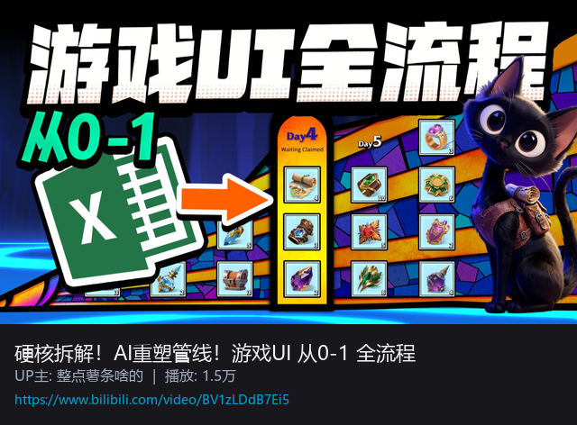</a> 
<a href="https://www.bilibili.com/video/BV1zLDdB7Ei5"><b>硬核拆解！AI 重塑管线！游戏 UI 从 0-1 全流程</b></a>
</td>
<td align="center" width="33%">
<a href="https://www.bilibili.com/video/BV1PV4y1U7nb">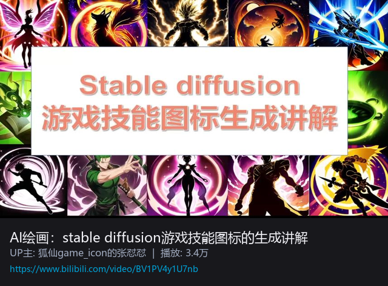</a> 
<a href="https://www.bilibili.com/video/BV1PV4y1U7nb"><b>游戏技能图标生成</b></a>
</td>
<td align="center" width="33%">
<a href="https://www.bilibili.com/video/BV1up4aeaEPp">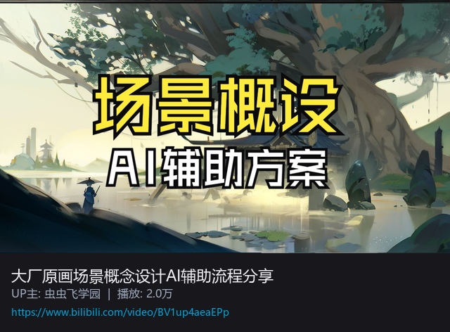</a> 
<a href="https://www.bilibili.com/video/BV1up4aeaEPp"><b>场景概念设计 AI 辅助流程</b></a>
</td>
</tr>
</table>

| 案例 | 工作流切入点 | 可借鉴方向 |
|---|---|---|
| [游戏 UI 从 0-1 全流程](https://www.bilibili.com/video/BV1zLDdB7Ei5) | 从界面风格、组件方向到视觉规范，强调 AI 辅助前期推演。 | 适合 UI 风格探索、活动界面方向、按钮图标、面板气质和多版本方案对比。 |
| [游戏技能图标生成](https://www.bilibili.com/video/BV1PV4y1U7nb) | 小尺寸、高数量、强风格统一的图标类资产，很适合批量生成和筛选。 | 适合技能、道具、Buff、装备、任务物品、商城资源的图标方向探索。 |
| [场景概念设计 AI 辅助流程](https://www.bilibili.com/video/BV1up4aeaEPp) | 把场景概念从单张气氛图推进到关卡、建筑、物件和空间语言。 | 适合关卡概念、区域设定、建筑风格、道具拆分和外包沟通参考。 |

### 使用场景

| 使用场景 | 具体玩法 | 判断标准 |
|---|---|---|
| UI 风格探索 | 生成不同主题的界面面板、按钮、弹窗、活动入口和信息层级方向。 | 是否能服务后续组件化，而不是只是一张漂亮界面图。 |
| 技能 / 道具图标 | 批量生成统一风格的技能、装备、材料、Buff、任务物品图标。 | 小尺寸下是否清晰，系列之间是否风格一致。 |
| 场景概念设计 | 为关卡、主城、据点、商店、地下城、活动区域生成多版空间氛围。 | 是否能帮助策划、美术、关卡设计快速对齐方向。 |
| 资产拆分与入库 | 将场景拆成可复用的门窗、灯具、植物、机器、招牌、装饰件。 | 是否具备统一视角、透明底、命名和分类规范。 |
| UGC / Mod 工具 | 为玩家自定义地图、角色、道具、封面和玩法说明提供生成模板。 | 用户是否能低门槛产出“像这个游戏”的内容。 |
| 外包沟通参考 | 用 AI 图快速说明风格、构图、材质、光照和细节密度。 | 是否能减少反复解释和返工。 |

### 典型产出

| 类型 | 典型产出 | 可延展为产品能力 |
|---|---|---|
| UI 资产 | 面板方向、按钮样式、弹窗草图、活动入口、界面氛围图 | UI 风格探索工具、活动界面模板 |
| 图标资产 | 技能图标、道具图标、装备图标、Buff 图标、任务物品图 | 图标批量生成器、资产入库辅助 |
| 场景资产 | 关卡概念图、区域气氛图、建筑参考、物件拆分图 | 场景概念工具、外包参考生成器 |
| UGC 资产 | Mod 封面、自定义角色图、地图主题图、玩法说明图 | UGC 编辑器素材库、玩家创作工具 |

---

## 五、活动运营与营销物料：快速铺出可选择的视觉方向

### 段落概述

活动运营和营销物料的需求特点是数量多、变化快、周期短。节日活动、版本更新、皮肤上线、礼包售卖、社区投稿、信息流广告，都需要在短时间内产出大量方向稿和尺寸变体。AI 美术适合承担前期探索、背景替换、局部修改、扩图重构、风格变体和 A/B 测试素材，让设计资源集中在最终上线图的精修与品质把控上。

这类场景不应该追求“AI 一键直出最终商用图”，而是把 AI 当成视觉方案生成器。它先开出足够多的方向，让产品、运营、美术、市场能快速判断哪条路最值得继续做。尤其在活动早期，很多需求还没有完全定稿，AI 可以用较低成本把“可能的样子”先摆出来。

### 参考案例

<table>
<tr>
<td align="center" width="33%">
 
<a href="https://www.bilibili.com/video/BV1eXszz2EBF"><b>3 分钟做出专业级海报</b></a>
</td>
<td align="center" width="33%">
 
<a href="https://www.bilibili.com/video/BV1Zv7GzZErW"><b>游戏 ICON + 美宣海报 AI 直出</b></a>
</td>
<td align="center" width="33%">
 
<a href="https://www.bilibili.com/video/BV1dULizJE1e"><b>商用级 Flux AI 换装试衣工作流</b></a>
</td>
</tr>
</table>

| 案例 | 工作流切入点 | 可借鉴方向 |
|---|---|---|
| [3 分钟做出专业级海报](https://www.bilibili.com/video/BV1eXszz2EBF) | 快速生成海报方向，适合验证构图、主体、色调和卖点表达。 | 活动 KV、节日海报、社区长图、版本预热图。 |
| [游戏 ICON + 美宣海报 AI 直出](https://www.bilibili.com/video/BV1Zv7GzZErW) | 把游戏图标和美宣包装放在同一套生产逻辑里。 | ICON、商店图、礼包图、皮肤宣传图、广告素材。 |
| [商用级 Flux AI 换装试衣工作流](https://www.bilibili.com/video/BV1dULizJE1e) | 用换装、替换和局部重绘支持商品展示或角色皮肤包装。 | 皮肤预览、服装变体、联动服饰、角色商业化素材。 |

### 使用场景

| 使用场景 | 具体玩法 | 判断标准 |
|---|---|---|
| 活动 KV 探索 | 围绕同一活动主题生成多种构图、色调、角色组合和视觉风格。 | 是否能快速筛出 2-3 个值得精修的方向。 |
| 节日包装 | 春节、七夕、万圣节、圣诞、周年庆等节点生成主题视觉。 | 是否能稳定替换主题元素，并保持品牌识别。 |
| 商店图与礼包图 | 为道具、礼包、皮肤、抽卡活动生成展示图和卖点图。 | 商品主体是否清楚，卖点是否能一眼识别。 |
| 多平台尺寸适配 | 横版 banner、竖版封面、方形社区图、信息流广告图互相扩图和重构图。 | 不同尺寸下主体、文字和视觉重心是否成立。 |
| A/B 测试素材 | 同一卖点生成多组风格、构图和文案空间，用于投放测试。 | 是否能形成可比较的变量，而不是随机出图。 |
| 老素材翻新 | 对旧活动图进行高清化、扩图、换背景、局部细化和风格升级。 | 是否保留原活动识别，同时符合当前审美。 |

### 典型产出

| 类型 | 典型产出 | 可延展为产品能力 |
|---|---|---|
| 活动物料 | 活动主视觉、节日海报、版本预热图、社区长图 | 活动 KV 方向生成器、运营模板库 |
| 商业化素材 | 皮肤海报、礼包图、商城展示图、抽卡背景图 | 商品图生成器、皮肤包装工作流 |
| 投放素材 | 信息流广告图、短视频封面、多尺寸广告变体 | A/B 测试素材生成器、投放素材工厂 |
| 翻新与适配 | 高清修复图、扩图版本、背景替换图、横竖版重构图 | 老素材翻新工具、多尺寸适配工具 |

---

## 六、创造 · IP 与同人续写：让喜欢的内容继续生长

### 段落概述

这一类场景更偏创作和情感连接：为喜欢的作品续写结局，为一首歌配画面，把记忆中的场景重新视觉化，把游戏角色放进新的画风，或者从一个 OC 角色开始搭建自己的小型 IP 宇宙。它不一定直接进入商业生产管线，但很容易激发用户投入，因为用户不是在“生成图片”，而是在补完自己心里的故事。

AI 美术在这里的价值，是把原本需要绘画、分镜、剪辑、设定能力才能完成的表达门槛降下来。用户可以先用图像把脑内画面摆出来，再慢慢发展成短片、MV、条漫、角色设定集、同人海报或连续内容。对产品来说，这类能力可以延展为创作工具、粉丝活动、同人投稿、角色宇宙生成器和社区内容生态。

### 参考案例

<table>
<tr>
<td align="center" width="33%">
<a href="https://www.bilibili.com/video/BV1YLQyBrEWk">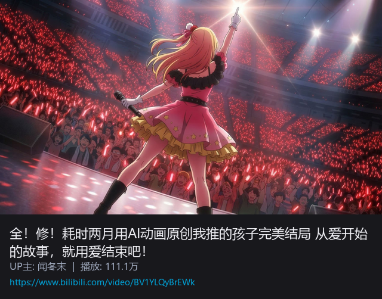</a> 
<a href="https://www.bilibili.com/video/BV1YLQyBrEWk"><b>全修！AI 动画原创《我推的孩子》完美结局</b></a>
</td>
<td align="center" width="33%">
<a href="https://www.bilibili.com/video/BV1moojBqEX1">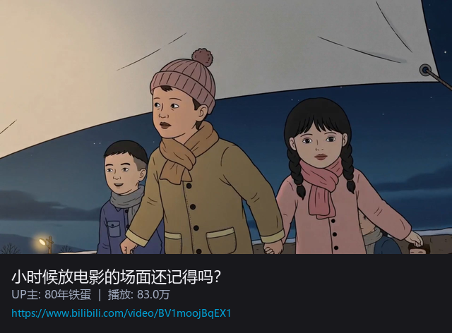</a> 
<a href="https://www.bilibili.com/video/BV1moojBqEX1"><b>小时候放电影的场面还记得吗？</b></a>
</td>
<td align="center" width="33%">
<a href="https://www.bilibili.com/video/BV1zv4y1E7ZH">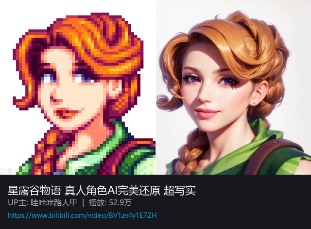</a> 
<a href="https://www.bilibili.com/video/BV1zv4y1E7ZH"><b>星露谷物语 · 真人角色 AI 完美还原</b></a> 
</td>
</tr>
</table>

| 案例 | 创作切入点 | 可借鉴方向 |
|---|---|---|
| [《我推的孩子》完美结局](https://www.bilibili.com/video/BV1YLQyBrEWk) | 为已有作品续写或改写结局，用 AI 视觉补完粉丝情绪。 | 同人续写、结局改写、角色命运补完、粉丝向短片。 |
| [小时候放电影的场面还记得吗？](https://www.bilibili.com/video/BV1moojBqEX1) | 把个人记忆和怀旧场景重新视觉化。 | 回忆短片、年代氛围图、音乐配图、情绪向内容。 |
| [星露谷物语 · 真人角色 AI 完美还原](https://www.bilibili.com/video/BV1zv4y1E7ZH) | 将喜欢的角色迁移到新画风或真人化语境中。 | 角色画风迁移、真人化、同人海报、粉丝设定集。 |

### 使用场景

| 使用场景 | 具体玩法 | 判断标准 |
|---|---|---|
| IP 打造与 OC | 从一个角色设定开始扩展外观、服装、关系、场景和故事片段。 | 角色是否能稳定复现，并持续延展。 |
| 同人续写 / 改写 | 为动漫、游戏、影视作品补完结局、番外、平行世界或未讲完的桥段。 | 是否尊重原作识别点，同时给出新的情绪价值。 |
| 音乐视觉化 | 为一首歌生成封面、分镜、MV 氛围图、歌词画面和情绪片段。 | 画面是否贴合节奏、歌词和情绪走向。 |
| 记忆与怀旧内容 | 把童年场景、旧照片、校园记忆、地方生活转成视觉短片或长图。 | 是否能触发共鸣，而不是只做复古滤镜。 |
| 角色画风迁移 | 将喜欢的角色放进写实、港片、像素、国潮、水墨、真人化等风格。 | 是否保持角色核心识别，同时形成新鲜感。 |
| 粉丝创作活动 | 提供统一模板，让用户提交自己的结局、角色卡、MV 分镜或同人海报。 | 是否降低创作门槛，并形成可展示的社区作品集。 |

### 典型产出

| 类型 | 典型产出 | 可延展为产品能力 |
|---|---|---|
| 角色创作 | OC 设定图、角色关系图、服装变体、角色海报 | 角色宇宙生成器、OC 创作工具 |
| 同人内容 | 改写结局图、番外分镜、同人海报、平行世界设定 | 同人投稿模板、粉丝活动工具 |
| 音乐与记忆 | MV 分镜、歌词配图、怀旧场景图、情绪短片关键帧 | 音乐视觉化工具、记忆影像生成器 |
| 画风迁移 | 真人化角色、不同画风版本、角色设定集、粉丝收藏图 | 角色换风格模板、IP 衍生内容工具 |

---

## 小结

AI 美术工作流的价值，不只是“把图生成得更快”，而是把不同层级的视觉需求变成可验证、可复用、可扩展的能力。轻量场景解决“用户愿不愿意发”，社区场景解决“内容能不能传播”，风格碰撞解决“项目有没有记忆点”，游戏资产解决“能不能进入生产”，运营物料解决“能不能快速铺量”，IP 与同人创作解决“用户有没有持续表达的空间”。

判断一个方向是否值得继续做，可以先看三件事：

| 判断维度 | 关键问题 |
|---|---|
| 是否有明确入口 | 用户是在聊天、发图、做活动、做资产，还是在补完自己的故事？ |
| 是否能形成模板 | 这个工作流能不能从单次生成，沉淀成可配置、可复用、可批量生产的模板？ |
| 是否能接上产品目标 | 它最终服务的是传播、留存、商业化、UGC、研发效率，还是品牌与 IP 建设？ |

如果一个 AI 美术场景只能生成一张好看的图，它更像灵感工具；如果它能稳定地连接用户行为、内容传播和生产流程，就开始具备产品化价值。后续真正要做的，不是把所有场景一次性做完，而是从最容易验证的入口开始：先让用户愿意用、愿意发，再逐步沉淀成活动模板、资产管线和创作工具。
